# Enkore Karaoke Digital Operations Management System

> **Bridging the Ultimate Entertainment Experience with Efficient Backend Management**

This system utilizes a **"Dual-Core Drive"** architecture to seamlessly link the user journey with enterprise-level control through real-time data flow.

---

## 🚀 System Overview

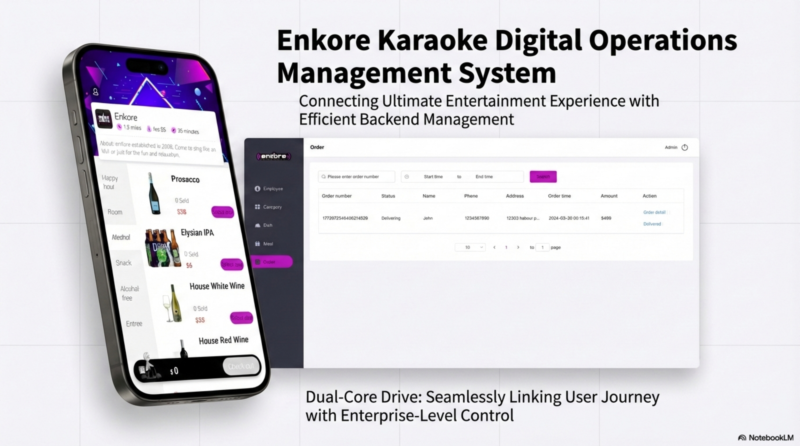

---

## 📱 Demand Side: Immersive User Journey

### 1. Seamless Access & Personalization Hub
Reduces entry friction and enhances retention through streamlined verification and scenario-based management.
- **Quick Login:** Minimalist verification to boost conversion rates.
- **Smart Address Book:** Scenario-based tags (Home, Work, School) for precision delivery.
- **Personal Center:** Centralized tracking of order history and preferences.

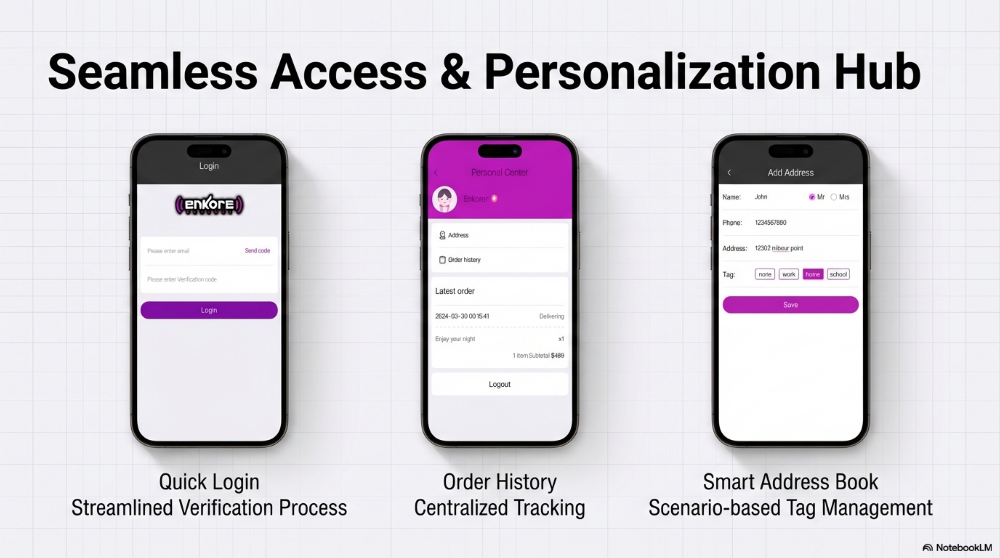

### 2. Immersive Ordering Experience
- **Visual-First Design:** High-quality imagery designed to stimulate purchase desire.
- **Deep Customization:** Supports fine-grained options such as "No Ice" or "Normal Temp."
- **Efficient Navigation:** Sidebar category switching for fast browsing of rooms, snacks, and drinks.

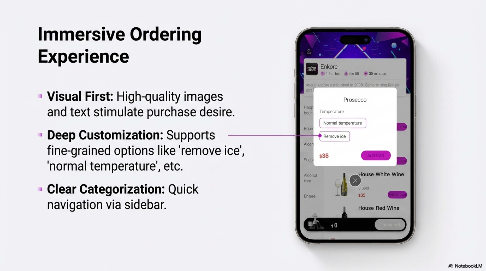

### 3. Fast Checkout & Real-time Tracking
- **Transparent Pricing:** Clear display of package details and total amounts.
- **Instant Feedback:** Provides estimated arrival times immediately after order placement.
- **Full-Link Tracking:** Real-time synchronization of preparation and delivery status to eliminate waiting anxiety.

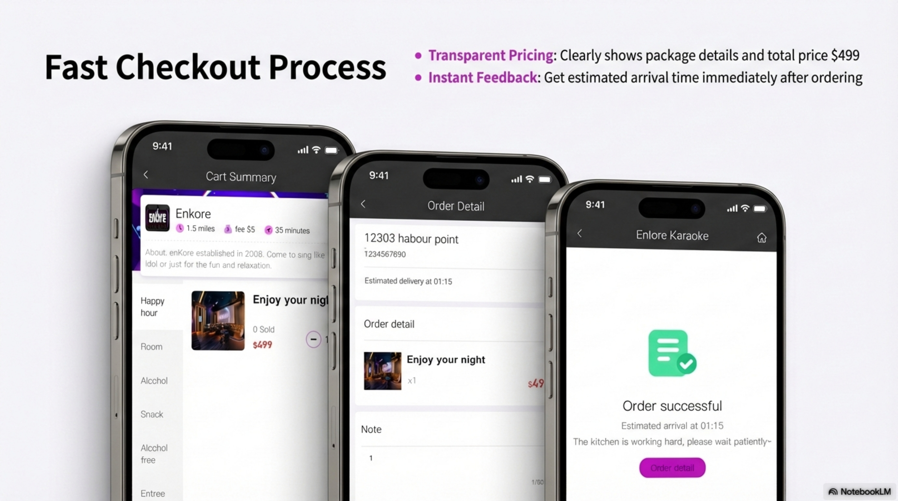
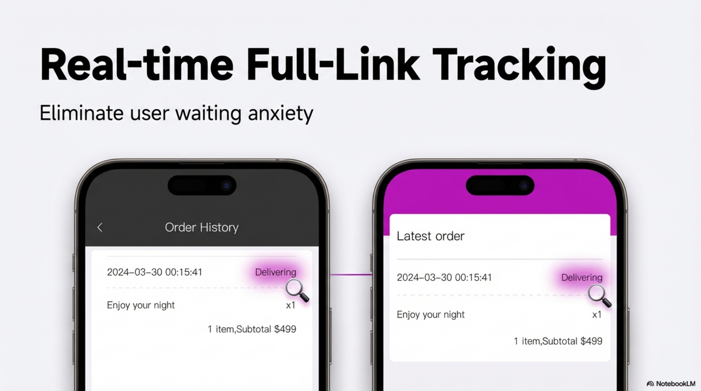

---

## 💻 Supply Side: Enterprise-Grade Control

### 1. Secure Access & Command Center
A dedicated secure gateway for management with a modern, clean UI, ensuring operational efficiency and data safety.

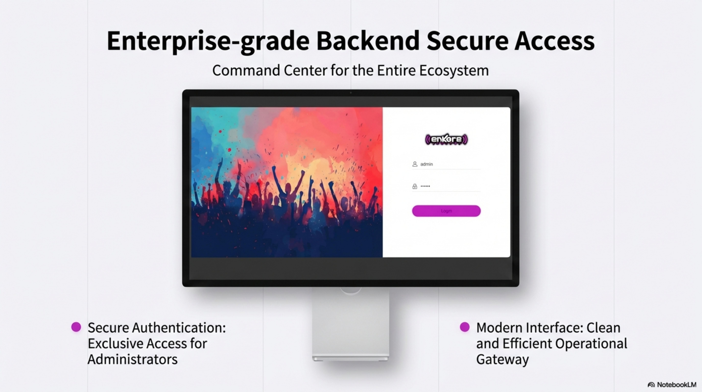

### 2. Strategic Menu & Inventory Management
- **Flexible Architecture:** Supports "Dish" and "Meal" types with 1-5 level custom sorting logic.
- **Refined Control:** One-click stop-sale/bulk management with instant synchronization to the user app.
- **Flavor Configuration:** Backend definition of all frontend customization options.

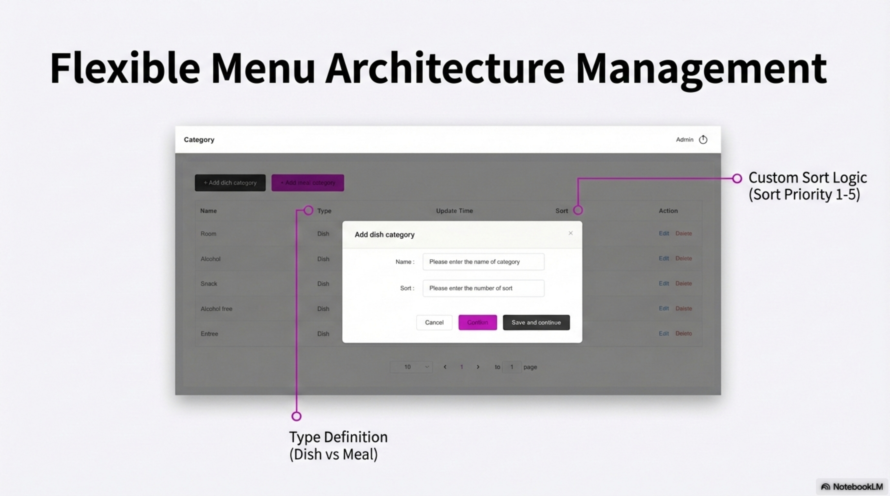
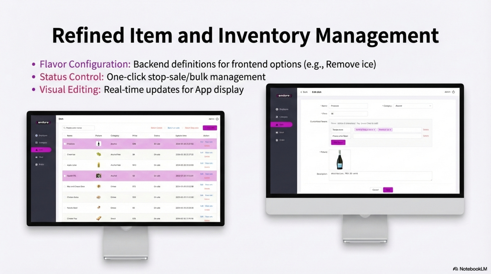

### 3. High-Ticket Package (AOV) Strategy
- **Multi-SKU Aggregation:** Bundles complex items (e.g., Big Room + 24 units of beverage).
- **One-Click Pricing:** Rapidly generates high-value packages (e.g., $499) to optimize revenue.

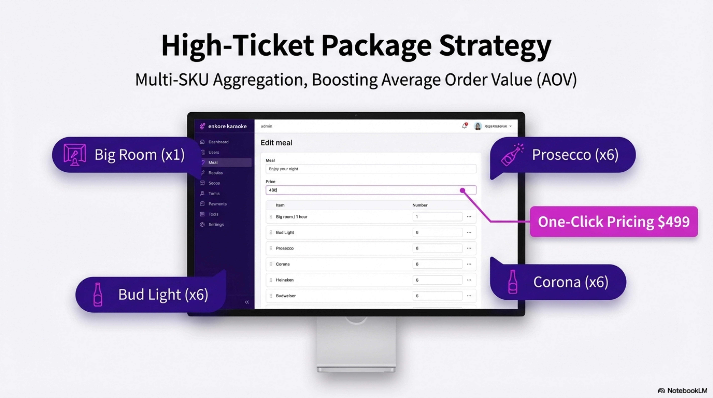

### 4. Smart Order Command Center
- **Panoramic View:** Real-time monitoring of customer info, order amounts, and current status.
- **Multi-dimensional Filtering:** Quick retrieval by order number or specific time ranges.
- **Closed-Loop Processing:** Seamlessly review details, update status, and sync to the User App.

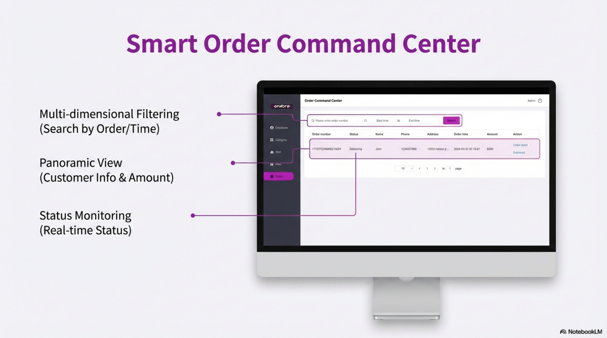
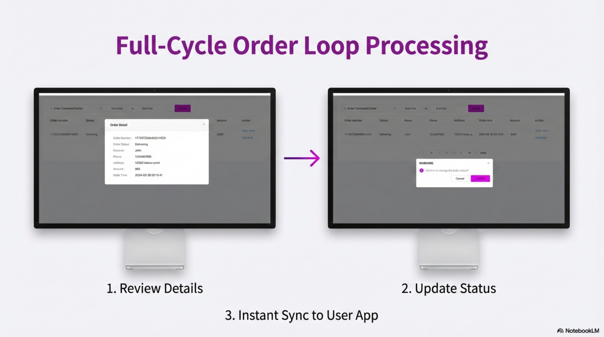

### 5. Team & Permission Governance
- **Employee Profiles:** Detailed data entry for all team members.
- **Account Control:** Instant activation or freezing of employee accounts.
- **Role-Based Access:** Secure operational permissions based on team hierarchy.

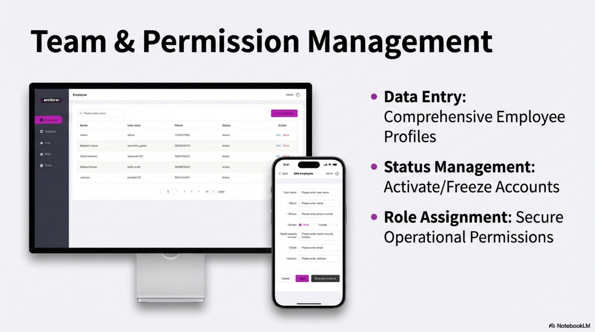

---

## 🔄 Dual-Core Ecosystem

The system ensures millisecond-level synchronization between "User Demand" and "Backend Supply," building a transparent, efficient, and controllable digital operation ecosystem.

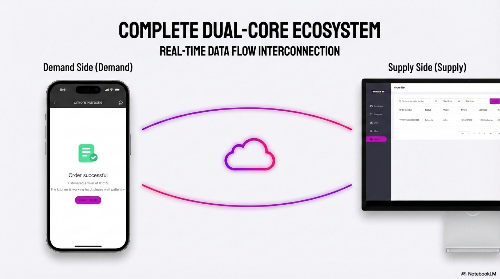

---

© 2024 Enkore Karaoke Digital Operations. All rights reserved.
