# Enkore

Enkore is a full-stack ordering and operations demo for a karaoke venue. Customers can browse rooms, drinks, snacks, and bundles from a mobile web interface, while staff manage the menu, orders, and employees from a separate admin console.

The project is built as a Spring Boot application with two static web clients: a Vant-based customer experience and an Element UI management dashboard.

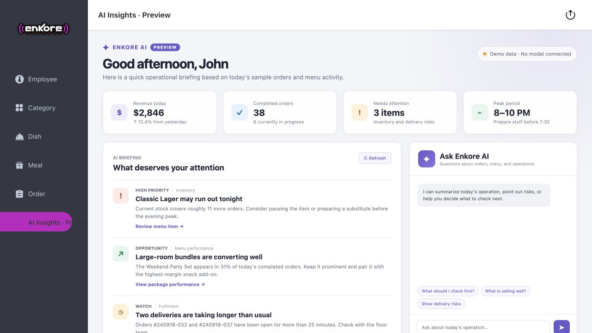

## What it includes

### Customer experience

- Mobile login and personal profile
- Menu browsing by category
- Dish options and flavor selection
- Shopping cart and checkout
- Address book
- Order confirmation, history, and status tracking

| Sign in | Browse the menu | Choose preferences |
| --- | --- | --- |
| 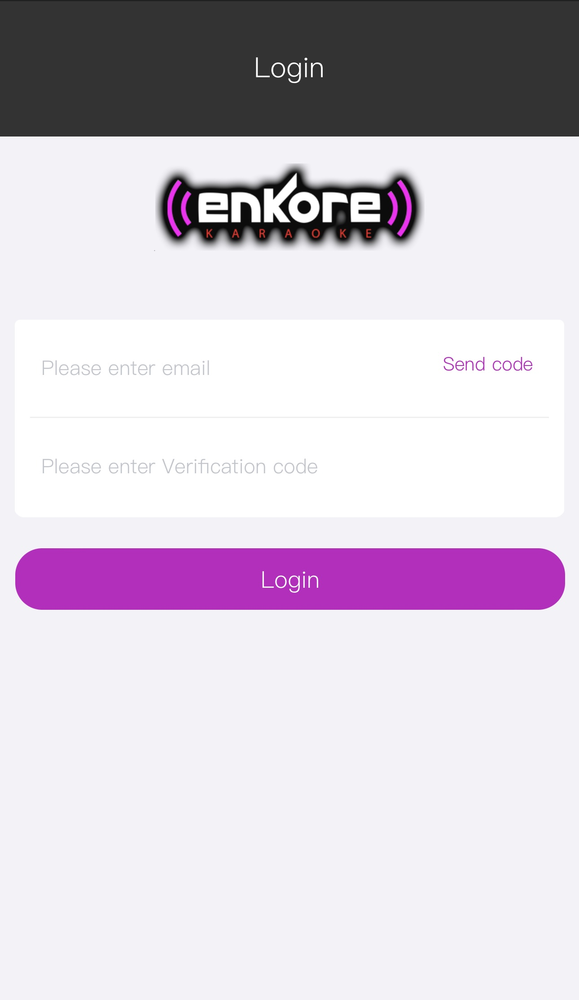 | 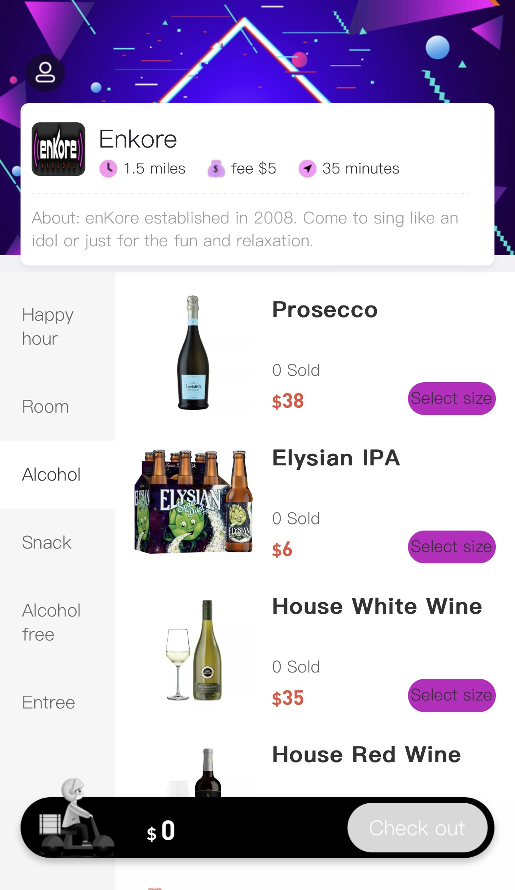 | 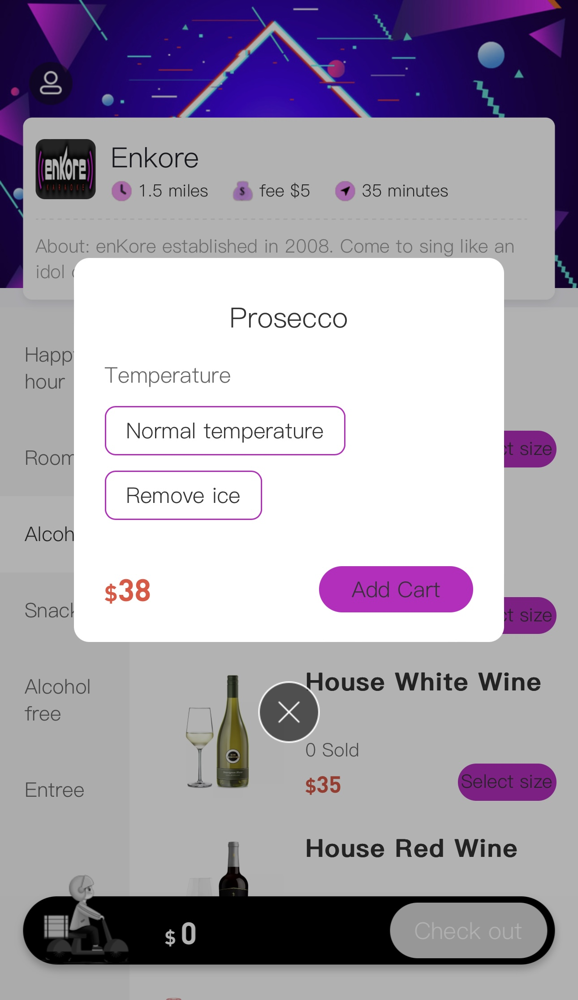 |

| Shopping cart | Delivery address | Review order |
| --- | --- | --- |
| 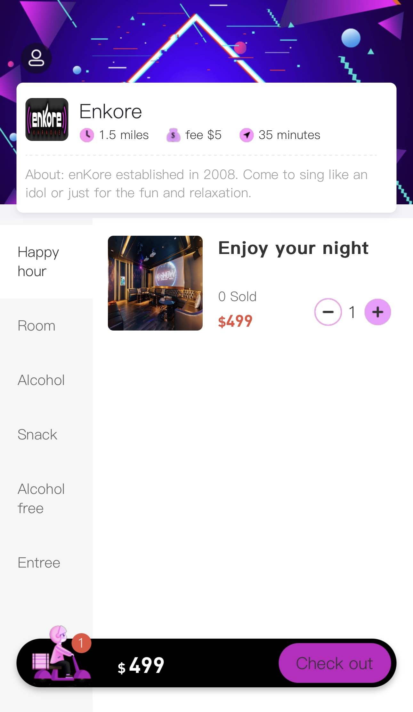 | 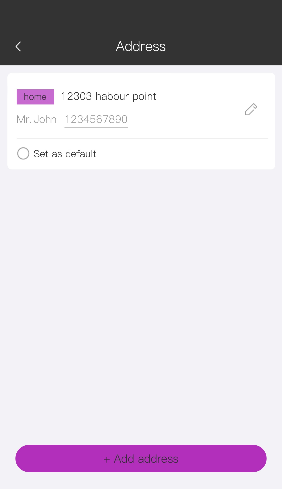 | 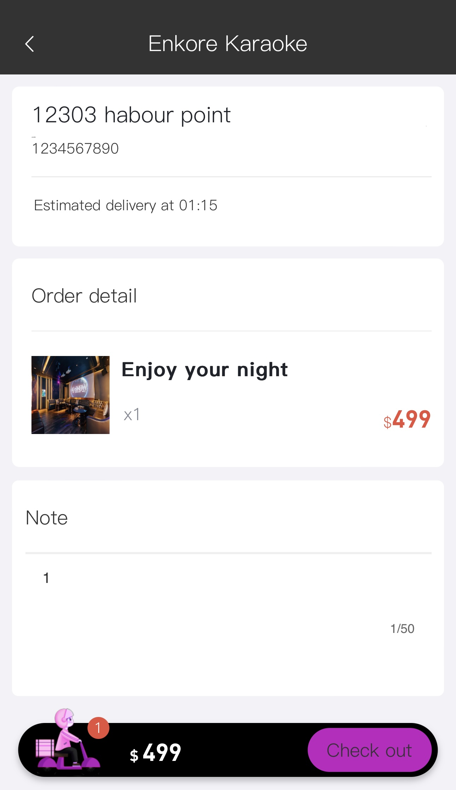 |

| Order placed | Order history | Personal center |
| --- | --- | --- |
| 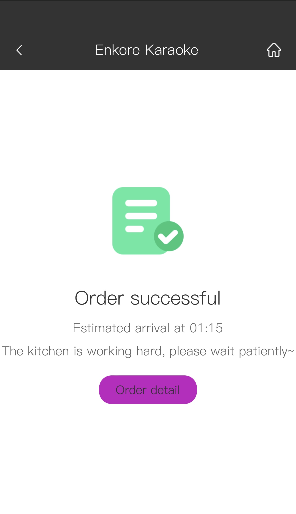 | 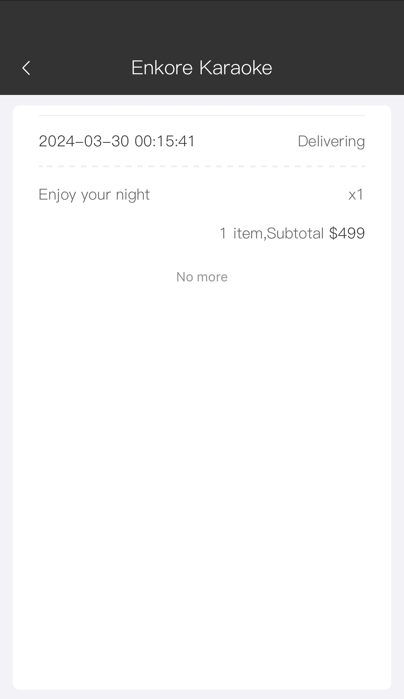 |  |

### Operations console

- Employee account management
- Dish and category management
- Meal and room bundle configuration
- Menu item availability controls
- Order search, detail view, and status updates

| Employee accounts | Categories |
| --- | --- |
| 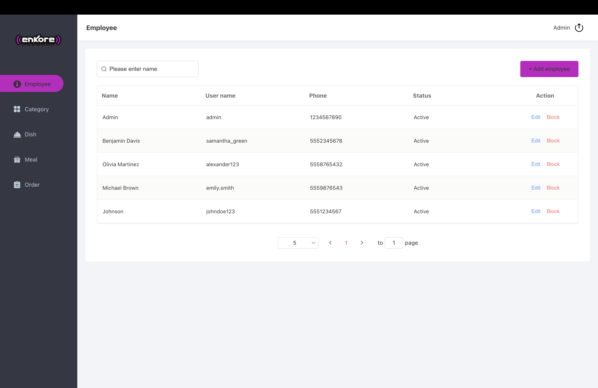 | 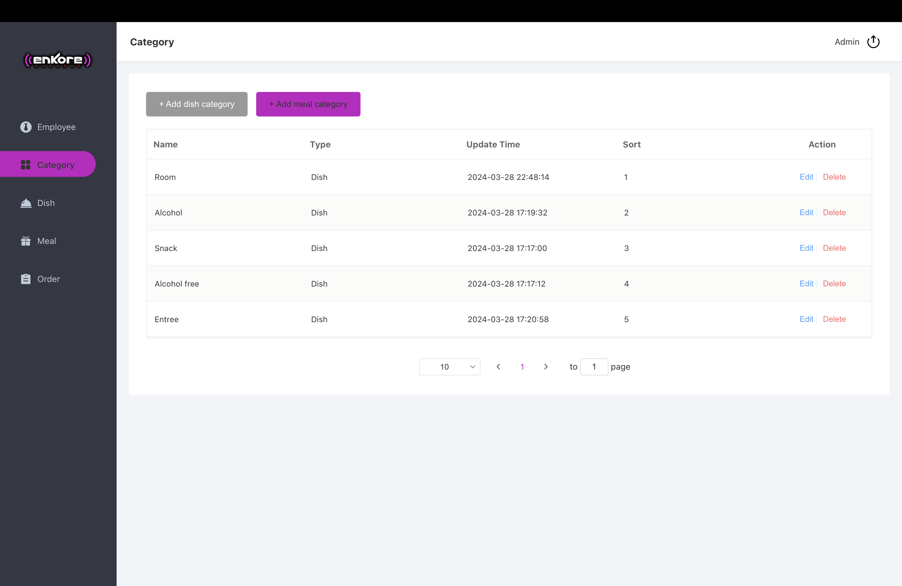 |

| Menu management | Package management |
| --- | --- |
| 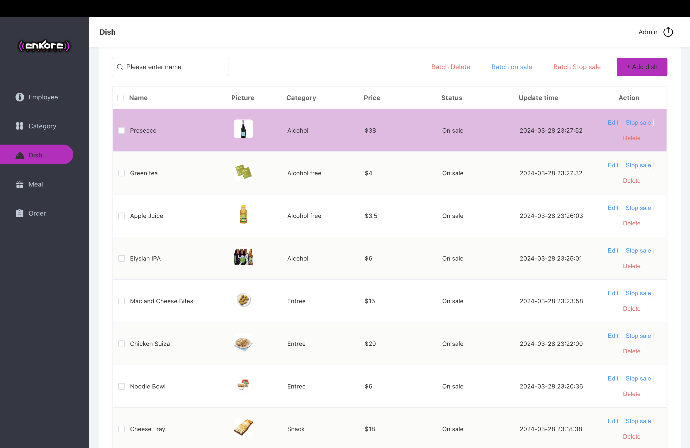 | 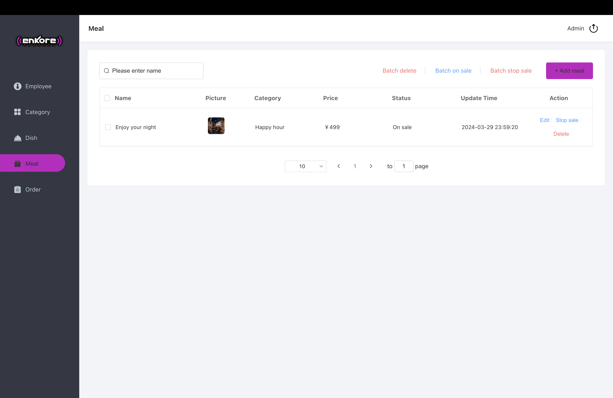 |

| Order operations | Order detail |
| --- | --- |
| 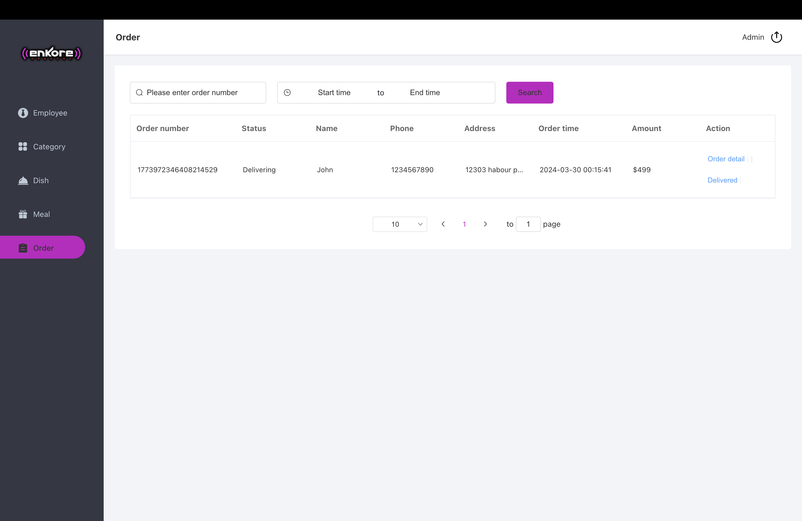 | 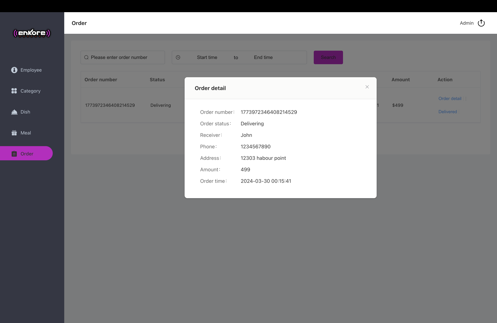 |

## AI operations preview

The admin sidebar now includes an **AI Insights · Preview** workspace. It demonstrates how an operations assistant could summarize revenue, order activity, inventory risks, delivery delays, and menu opportunities.

The screenshot at the top of this README shows the complete preview inside the existing admin console, including the new navigation entry, daily metrics, operational observations, and chat panel.

The preview includes a small question-and-answer interaction for presentation purposes. Its figures and responses are fixed local demo scenarios: no external model is connected and it does not make operational decisions.

A future implementation could replace the demo layer with live order and inventory aggregation, retrieval over store data, and a production AI provider.

## Tech stack

| Layer | Technology |
| --- | --- |
| Application | Java 17, Spring Boot |
| Data access | MyBatis-Plus, MySQL |
| Admin UI | Vue 2, Element UI |
| Customer UI | Vue 2, Vant |
| Other integrations | Aliyun SMS, Spring Mail |

## Run locally

### Requirements

- Java 17
- Maven 3.8+
- MySQL 8

Create a MySQL database named `enkore_karaoke`, then configure the application through environment variables:

```bash
export DB_URL='jdbc:mysql://localhost:3306/enkore_karaoke?serverTimezone=Asia/Shanghai&useUnicode=true&characterEncoding=utf-8'
export DB_USERNAME='root'
export DB_PASSWORD='your-password'
export ENKORE_UPLOAD_PATH='./uploads/'
```

Start the application:

```bash
mvn spring-boot:run
```

Then open:

- Customer app: [http://localhost:8080/front/index.html](http://localhost:8080/front/index.html)
- Admin console: [http://localhost:8080/backend/index.html](http://localhost:8080/backend/index.html)

Mail credentials are optional and can be supplied with `MAIL_USERNAME` and `MAIL_PASSWORD`.

## Project structure

```text
src/main/
├── java/com/hongchao/enkore/
│   ├── controller/       HTTP endpoints
│   ├── service/          Application services
│   ├── mapper/           MyBatis-Plus data access
│   └── entity/           Domain models
└── resources/
    ├── backend/          Staff operations console
    ├── front/            Mobile customer app
    └── application.yml   Runtime configuration
```
